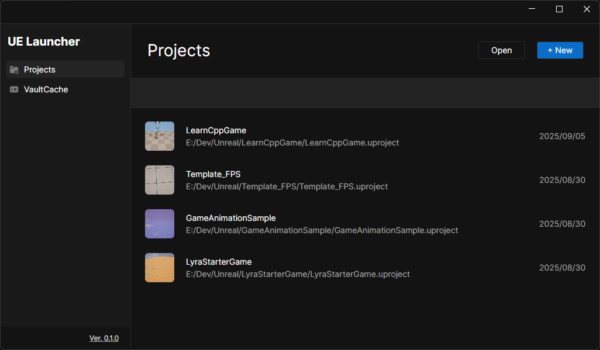

# UnrealLauncher

Highly inspired by **Unity Hub**, `UnrealLauncher` is a project launch tool for **Unreal Engine**, built with **Avalonia UI** and **.NET 9**. It provides a faster and more efficient way to manage and launch Unreal Engine projects, offering an alternative to the Epic Games Launcher.

## Existing Features

- [X] 🚀 **Project List Management**: Automatically scans and loads your Unreal Engine projects.
- [X] ⚡ **Quick Project Launch**: Launch your selected Unreal Engine project with the corresponding engine version.
- [X] 🎨 **Clean UI Layout**: Simple and responsive interface for managing your projects.
- [X] 🛠️ **Common Utility Functions**: Includes features like clearing cache files and regenerating Visual Studio project files for your Unreal Engine projects.

## Planned Features

- [ ] 📦 **VaultCache Management**: Future feature to manage local VaultCache for your projects.
- [ ] 🛠️ **Additional Utility Functions**: More functions for UE devs.

## Screenshots



## Getting Started

```bash
# Clone the repository
git clone https://github.com/yourname/UnrealLauncher.git
cd UnrealLauncher

# Build and run with .NET 9
dotnet build
dotnet run
```

## License

This project is licensed under the MIT License - see the [LICENSE](LICENSE) file for details.

### Avalonia UI License

Avalonia UI is licensed under the MIT License. For more information, visit [Avalonia GitHub Repository](https://github.com/AvaloniaUI/Avalonia).
